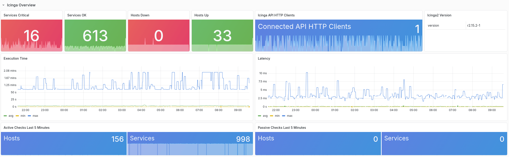

# Icinga2 exporter

A Prometheus exporter for Icinga2.

The `icinga2-exporter` for Prometheus allows you to scrape status and statistics information from Icinga2 to monitor the health of the Icinga instance. The exporter does not export data from individual hosts or services, for this you can use Icinga2's OTLPMetricsWriter.



## Installation and Usage

The `icinga2-exporter` listens on HTTP port 9665 by default.
See the `-help` output for more options.

```
-collector.apilistener
      Include APIListener data
-collector.cib
      Include CIB data
-collector.checker
      Include CheckerComponent data
-collector.graphite
      Include GraphiteWriter data
-collector.influx
      Include InfluxDBWriter  data
-collector.influx2
      Include InfluxDB2Writer data
-collector.otlpmetrics
      Include OTLPMetricsWriter data
-debug
      Enable debug logging
-icinga.api string
      Path to the Icinga2 API (default "https://localhost:5665/v1")
-icinga.cafile string
      Path to the Icinga2 API TLS CA
-icinga.certfile string
      Path to the Icinga2 API TLS cert
-icinga.insecure
      Skip TLS verification for Icinga2 API
-icinga.keyfile string
      Path to the Icinga2 API TLS key
-icinga.password string
      Password for the Icinga2 API user. This can also be set via the ICINGA2_EXPORTER_HTTP_PASSWORD environment variable.
-icinga.username string
      Username for the Icinga2 API user
-version
      Print version
-web.cache-ttl uint
      Cache lifetime in seconds for the Icinga API responses (default 60)
-web.listen-address string
      Address on which to expose metrics and web interface. (default ":9665")
-web.metrics-path string
      Path under which to expose metrics. (default "/metrics")
```

Note that the exporter does not offer authentication. This must be done via a reverse proxy, for example.

### Environment Variables

Some values can be set via environment variables:

| Name     | Description |
| -------- | ----------- |
| ICINGA2_EXPORTER_HTTP_PASSWORD   | Password for the Icinga2 API User |

### Cache

The exporter caches the responses from the Icinga2 API to decrease load on the API.
The lifetime of the cache can be adjusted with `-web.cache-ttl`.

## Collectors

By default only the `IcingaApplication` metrics of the status API are collected.

There are more collectors that can be activated via the CLI.
The tables below list all existing collectors.

| Collector     | Flag       |
| ------------- | ---------- |
| APIListener   | `-collector.apilistener` |
| CIB           | `-collector.cib`         |
| CheckerComponent | `-collector.checker`  |
| InfluxDBWriter   | `-collector.influx`   |
| InfluxDB2Writer  | `-collector.influx2`  |
| GraphiteWriter   | `-collector.graphite` |
| OTLPMetricsWriter | `-collector.otlpmetrics` |

# Development

Prerequisites:

* [Go compiler](https://golang.org/dl/)

Building:

```
git clone https://github.com/NETWAYS/icinga2-exporter.git
cd icinga2-exporter
make build
./dist/icinga2-exporter <flags>
```

Running tests:

```
make test
make coverage
```
